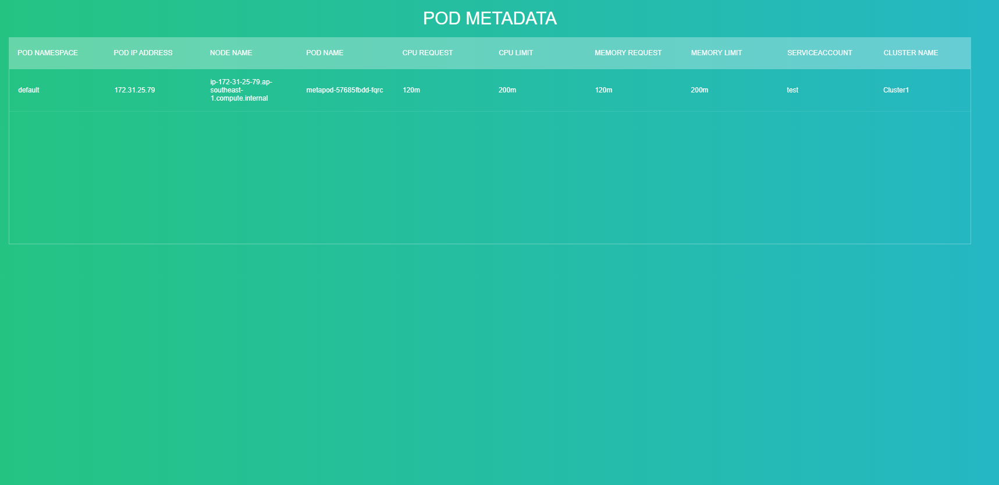
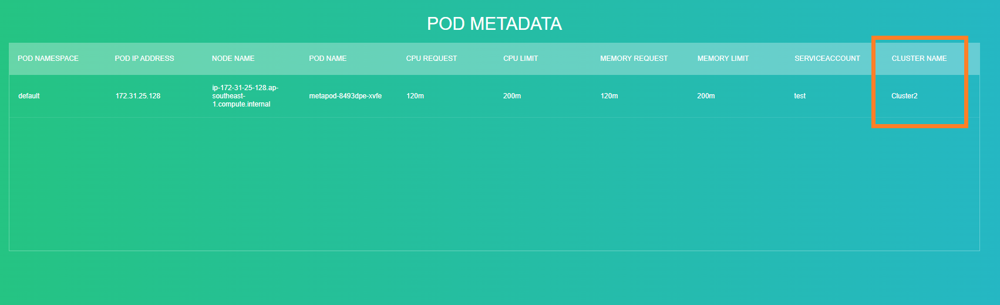

# MetaPod #


`Metapod` is a short Golang application that allows you to verify which the pod is residing to specially on Kubernetes with traffic distribution on different clusters like `Service Mesh`.


| Stack 💡                 | Version |
| ------------------------ | ------- |
| Golang                   | 1.16    |
| Gin Gonic REST Framework | v1.7.7  |

***Note: Consider changing the value inside the `Makefile`***

Running the application
```
make start
```

Building the docker image
```
make build-image
```

Deploying the image
```
make deploy-image
```

Deployment on kubernetes ⚓
============================

On cluster1, Deploy the `cluster1-test-deployment.yaml`
```
kubectl apply -f cluster1-test-deployment.yaml
```

On cluster2, Deploy the `cluster2-test-deployment.yaml`
```
kubectl apply -f cluster2-test-deployment.yaml
```


Verification ✔️
================

Visit the [https://metapod.example.com/metapod](https://metapod.example.com/metapod) and watch closely the `CLUSTER NAME` column. It should be changing frequently from `cluster1` to `cluster2`






Reference
==========
- [Istio Multi Cluster](https://github.com/redopsbay/Istio-Multi-Cluster)